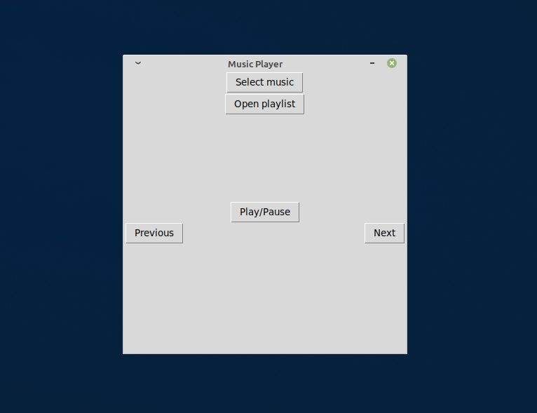

# MusicPlayer
Simple music player in Python


## Instalation

1. Clone the project and go to the project folder
```bash
git clone https://github.com/HicaroD/MusicPlayer.git && cd MusicPlayer
```

2. Install all the required libraries
Make sure you have the newest version of [PIP](https://pypi.org/project/pip/) (Package Installer for Python)
```bash
pip3 install -r requirements.txt
```

3. Run the program
Make sure you have python3.8 version installed
```bash
cd scripts/ && python3.8 main.py
```

## License 
This project is licensed under the terms of the MIT license.
